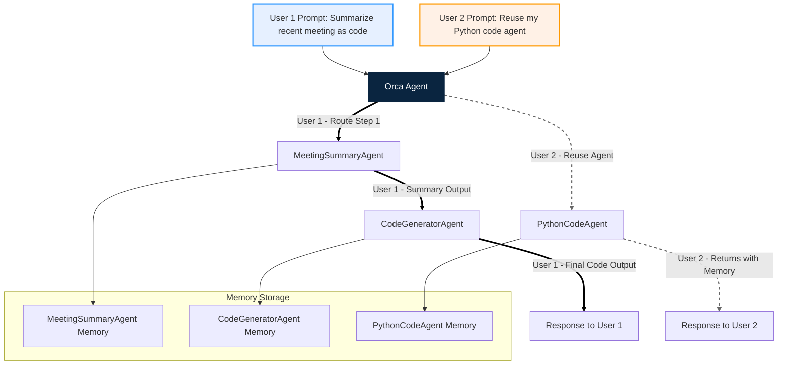

# Orchestrica

<div align="center">
  
</div>

<div align="center">
  <em>LLM agents orchestration made easy — build, manage, and scale your agent workflows with Orchestrica.</em>
</div>

<br />

Translations: **English** · [Korean](./docs/translation/README-kor.md)

**Orchestrica (Orca)** is a developer-friendly orchestration tool built on top of [Agentica](https://github.com/wrtnlabs/agentica), designed for creating, managing, and coordinating multiple AI agents.

It enables prompt-based or config-based agent deployment, and ensures safe and flexible LLM-centric interactions.

## Key Features

#### 🚀 Agent Orchestration
- Create and run agents using prompts or CLI commands
- Agents decide tools and actions on their own
- Supports running multiple agents in parallel or in sequence

#### 🐳 Containerized Agent Environment
- Provides isolated execution environments
- Eliminates the need for external dependency installation
- Enables quick setup and system-independent portability

#### 💾 Persistence Store
- Stores conversation history and agent status
- Helps agents maintain memory and session continuity

#### 🧠 LLM-Centric Interaction Layer
- Uses LLM to guide agent logic and decisions
- Supports smart responses, tool usage, and workflow control

## Quick Start
> Requires Node.js v18 or higher
```sh
npm install @orchestrica/cli
```

```sh
Usage: orca [options] [command]

Options:
  -h, --help      display help for command

Commands:
  start           Start Orca interactive CLI
  dashboard       Start Orca dashboard (UI)
  help [command]  display help for command
```
### Development
```sh
# For local development
cd packages/cli
npm run build
npm link
orca start
```
## System Design

Orchestrica is built to manage AI agents in a modular and extensible way.

Below is a simplified architecture flow:

<div align="center">
  
</div>

### Example


## Development Roadmap (Based on 2025.06.19 Discussion)

| Common                                | Frontend                                                      | Agent / Backend                                                                 | Deployment / Monitoring                                                                   |
|--------------------------------------|----------------------------------------------------------------|----------------------------------------------------------------------------------|--------------------------------------------------------------------------|
| [x] User scenario organization        | [ ] UI publishing (main screen, metrics dashboard, chat view)  | [ ] Agent prompt testing and system prompt refinement                           | [ ] Metric collection pipeline design (OpenTelemetry → Prometheus)       |
| [ ] Issue tracking tool + Git setup  | [ ] Grafana panel integration for dashboard                   | [x] Agent creation, deletion, saving features                                   | [ ] Define metrics to collect (e.g., function calls, token usage)        |
|                                      | [ ] Add views based on Swagger-provided API structure          | [ ] Natural language-based agent monitoring                                     | [ ] Docker Compose setup for containerized deployment                    |
|                                      |                                                                | [ ] Backend API to fetch Agentica metrics via OpenAPI                          |                                                                          |
|                                      |                                                                | [ ] Integrate vector DB to improve selector accuracy and reduce token usage    |                                                                          |
|                                      |                                                                | [x] Leverage Agentica system prompts (selector / caller / describer patterns) |                                                                          |
|                                      |                                                                | [ ] Evaluate and improve orchestration executor accuracy                       |                                                                          |

## Contributing

Please read our [contribution guidelines](./CONTRIBUTING.md) to get started.  
Whether it’s bug reports, new features, or improvements, your help is appreciated.