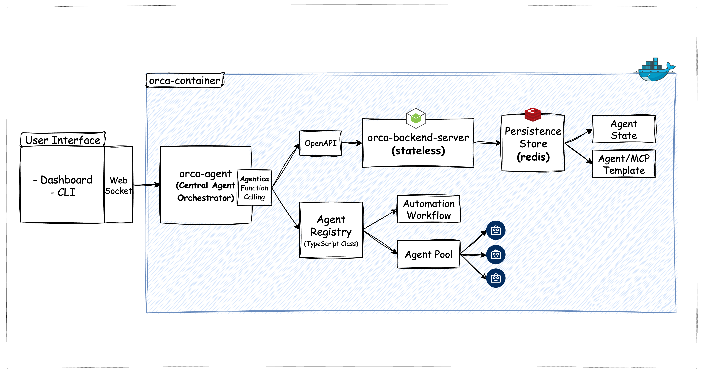

# Table of Contents
- [Key Features](#key-features)
- [Architecture](#architecture)
- [Roadmap](#roadmap)

<div align="center">
  
</div>

Translations: **English** · [Korean](./docs/translation/README-kor.md)

**Orchestrica (Orca)** is a developer-friendly orchestration tool built on top of [Agentica](https://github.com/wrtnlabs/agentica), designed for creating, managing, and coordinating multiple AI agents.

It enables prompt-based or config-based agent deployment, and ensures safe and flexible LLM-centric interactions.

# Key Features

### 🚀 Agent Orchestration
- Create and run agents using prompts or CLI commands
- Agents decide tools and actions on their own
- Supports running multiple agents in parallel or in sequence

### 💾 Persistence Store
- Stores conversation history and agent status
- Helps agents maintain memory and session continuity

### 🧩 Agent Template Management
- Define agent setups in YAML/JSON and reuse them
- Quickly launch agents for specific use cases

### 🧠 LLM-Centric Interaction Layer
- Uses LLM to guide agent logic and decisions
- Supports smart responses, tool usage, and workflow control

# Setup
```sh
npm install @orchestrica/cli
```

```sh
Usage: orca [options] [command]

Options:
  -h, --help      display help for command

Commands:
  start           Start Orca interactive CLI
  dashboard       Start Orca dashboard (UI)
  help [command]  display help for command
```

# Architecture

Orchestrica is built to manage AI agents in a modular and extensible way.

Below is a simplified architecture flow:

<div align="center">
  
</div>

### Workflow


# Roadmap

| Version | Features                                              |
| ------- | ----------------------------------------------------- |
| 0.1     | Manual agent creation/removal, logs, template saving  |
| 0.2     | Prompt-based agent orchestration, MCP/ACP integration |
| 0.3     | YAML/JSON agent deployment, multi-agent planning      |
| 0.4+    | UI dashboard and advanced visualization               |
