# Orchestrica (Orca)


Orchestrica (Orca) is a developer-friendly toolkit to orchestrate, launch, and manage [Agentica](https://github.com/wrtnlabs/agentica)-powered AI agents at scale. It supports prompt-based and CLI-based workflows, enabling automatic multi-agent orchestration, routing, and monitoring in a containerized environment.

---

## Overview

Orchestrica leverages an LLM-based orchestrator to manage lifecycle, task assignment, and communication between multiple Agentica agents. It supports:

* Prompt-based orchestration: User sends natural language requests, and Orchestrica deploys agents dynamically.
* Manual CLI workflows: Developers can create, list, route to, or monitor agents via a clean CLI.
* MCP Protocol Compliance: Agent interactions follow the Model Context Protocol, ensuring structured, predictable execution.
* Container-based agent isolation: Each agent runs in a Docker container for reproducibility and isolation.

---

## Architecture Diagram

```mermaid
flowchart TD
    A["User"] -->|"Prompt or CLI Command"| B["Orca Core"]
    B -->|"Agent Creation Request"| C["orca-mcp-server"]
    B -->|"Prompt-based Request"| C

    subgraph "orca-mcp-server"
        C1["Orchestration Agent (LLM + Controller)"]
        C2["Agent Factory (Docker Container Launcher)"]
        C3["Router (Prompt → Agent Routing)"]
        C4["Monitor (Token Usage & History Tracker)"]
        C1 --> C2
        C1 --> C3
        C1 --> C4
    end

    C2 -->|"Create NewsCrawler Agent"| AG1["Agent: NewsCrawler"]
    C2 -->|"Create NewsAnalyzer Agent"| AG2["Agent: NewsAnalyzer"]

    C3 -->|"Route Prompt: 'Create agents to crawl and analyze news'"| AG1
    AG1 -->|"Crawled News Data"| AG2
    AG2 -->|"Analysis Result"| C1

    B -->|"Final Response to User"| A
    C --> C1
```



---

## CLI Usage Examples

### Automatically spawn agents based on prompt *(Planned: full prompt orchestration in v0.3+)*

```bash
$ orca prompt "Please crawl today's AI news and summarize it."
```

**Expected Output:**

```
[orchestration-agent] Parsing prompt
[agent-factory] Creating agents: news_crawler, news_analyzer
...
[monitor] Tokens used: 9,128 | Agents active: 2
```

### Create agents manually *(Under active development)*

```bash
$ orca agent create crawler --image agentica/crawler:latest
$ orca agent create analyzer --image agentica/analyzer:latest
```

**Output:**

```
[agent-factory] Created crawler (container ID: abc123)
[agent-factory] Created analyzer (container ID: def456)
```

### Route prompt to a specific agent *(Under active development)*

```bash
$ orca prompt "Summarize this article." --target analyzer
```

**Output:**

```
[router] Prompt routed to analyzer
[analyzer] Summary: "This article covers AI regulation efforts."
```

### List running agents *(Under active development)*

```bash
$ orca agent list
```

**Output:**

```
NAME           STATUS     IMAGE                          CREATED         TOKENS USED
crawler        Running    agentica/crawler:latest        1m ago          -
analyzer       Running    agentica/analyzer:latest       45s ago         -
```

### View logs for a specific agent *(Under active development)*

```bash
$ orca agent logs analyzer
```

**Output:**

```
[INFO] Starting analysis...
[INFO] Articles processed: 5
[INFO] Positive: 3, Negative: 1, Neutral: 1
```

---

## System Components

| Component           | Description                                                            |
| ------------------- | ---------------------------------------------------------------------- |
| Orca Core           | CLI and Web frontend interface. Accepts prompts and shows results      |
| Orchestration Agent | LLM-based module that analyzes tasks, spawns agents, and manages flow  |
| Agent Factory       | Deploys Docker containers for each agent definition                    |
| Router              | Routes prompt to the correct agent(s) based on intent and system state |
| Monitor             | Tracks active agents, logs, and token usage per request *(Planned)*    |

---

## Communication Protocol (MCP)

All inter-agent communication and orchestrator interactions follow the [Model Context Protocol](https://github.com/anthropics/model-context-protocol), which includes:

* Support for `tools/list`, `tools/execute`, tool schema definitions
* Designed for compatibility with Claude, GPT, and other LLM backends

---

## Example Prompt Use Case *(Planned: full prompt orchestration to be released in v0.3+)*

**Prompt:**

```
"Please create agents to crawl real-time news about climate policy and analyze the sentiment."
```

**Execution Flow:**

1. User submits prompt to Orca Core
2. Orchestration Agent parses intent and determines agent requirements
3. Agent Factory deploys NewsCrawler and NewsAnalyzer
4. Router sends request to NewsCrawler
5. Crawled results passed to NewsAnalyzer
6. Sentiment analysis completed and returned
7. Monitor logs token usage and completion times
8. Final response returned to user

**Sample Output:**

```json
{
  "summary": "Coverage of global climate policy is mostly positive today.",
  "articles": 5,
  "tokens_used": 9823,
  "agents": ["news_crawler", "news_analyzer"]
}
```

---

## Roadmap

| Version | Features                                                                                |
| ------- | --------------------------------------------------------------------------------------- |
| 0.1     | Manual CLI agent creation, prompt routing to agent, log viewing                         |
| 0.2     | Token usage tracking, CLI-enhanced monitoring, basic prompt orchestration (static plan) |
| 0.3     | Dynamic multi-agent orchestration via LLM, prompt-to-agent planning                     |
| 0.4+    | Full UI dashboard, multi-agent context sharing, Kubernetes deployment support           |

---

## Contributing

We welcome pull requests, suggestions, and bug reports. Please refer to [CONTRIBUTING.md](./CONTRIBUTING.md) before contributing. Open issues for feedback or ideas.

---

## License

This project is licensed under the MIT License.

---

## Powered By

* [Agentica](https://github.com/wrtnlabs/agentica)
* [Docker](https://www.docker.com/)
* [Anthropic MCP Protocol](https://github.com/anthropics/model-context-protocol)
