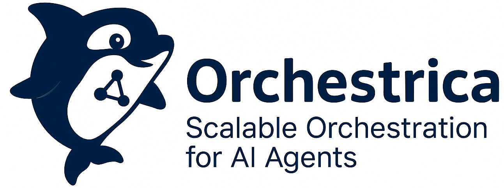
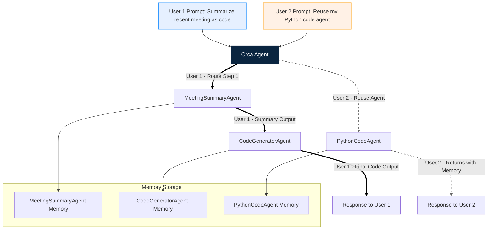

# 목차
- [주요 기능](#주요-기능)
- [로드맵](#로드맵)
- [라이선스](#라이선스)

  

번역: [English](../README.md) · **한국어**

**Orchestrica (Orca)** 는 [Agentica](https://github.com/wrtnlabs/agentica)를 기반으로 다양한 AI 에이전트의 생성, 관리, 조율을 지원하는 개발자 친화적인 오케스트레이션 툴입니다.

프롬프트 또는 CLI 기반으로 에이전트를 배포할 수 있으며, LLM 중심의 안전하고 유연한 상호작용을 보장합니다.

# 주요 기능

- **에이전트 오케스트레이션**  
  자연어 프롬프트 또는 사전 정의된 CLI 명령어를 기반으로 에이전트를 자동 생성 및 관리합니다. LLM의 추론 능력을 활용하여 에이전트의 행동을 결정하고, 적절한 도구를 선택하며 실행 흐름을 동적으로 제어합니다. 병렬 및 계층적인 에이전트 오케스트레이션을 지원합니다.

- **상태 저장소**  
  모든 대화 기록, 시스템 메시지, 내부 에이전트 상태를 저장하여 긴 문맥 기반의 상호작용을 지원합니다. 이를 통해 메모리 조회, 세션 지속성, 추적 가능한 에이전트 동작이 가능해집니다.

- **에이전트 템플릿 관리**  
  YAML 또는 JSON 형식으로 에이전트 템플릿을 정의하고 저장하며 재사용할 수 있습니다. 템플릿에는 모델 설정, 도구 스키마, 메모리 범위, 기본 시스템 프롬프트 등이 포함될 수 있어 도메인 특화된 에이전트를 빠르게 구성할 수 있습니다.

- **LLM 중심 상호작용 계층**  
  에이전트의 동작을 LLM 기반의 계획 및 추론 중심으로 구성하여, 상황에 맞는 응답 생성, 동적 함수 호출, 검색·코드 생성·요약 등의 도구 활용을 지원합니다.

# 로드맵

| 버전   | 주요 기능                                         |
| ------ | ------------------------------------------------ |
| 0.1    | 수동 에이전트 생성/삭제, 로그 확인, 템플릿 저장     |
| 0.2    | 프롬프트 기반 에이전트 오케스트레이션, MCP/ACP 연동 |
| 0.3    | YAML/JSON 기반 에이전트 배포, 다중 에이전트 플래닝 |
| 0.4+   | UI 대시보드 및 시각화 기능 고도화                   |

# License

MIT License