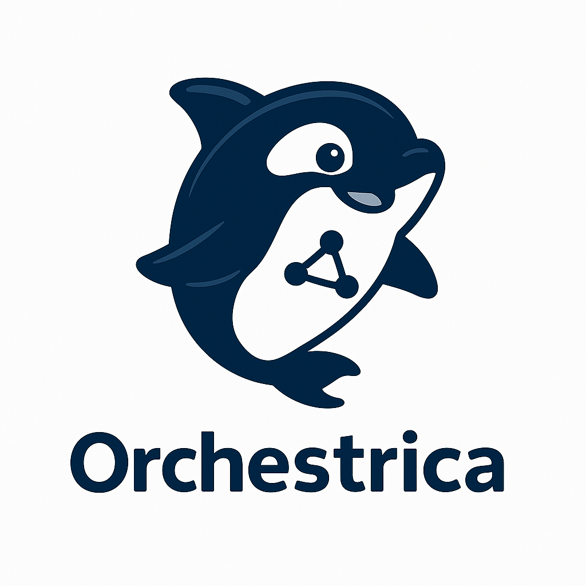

<div align="center">
  
</div>

Translations: [English](../README.md) · 한국어

**Orchestrica (Orca)**는 [Agentica](https://github.com/wrtnlabs/agentica)를 기반으로 다양한 AI Agent의 생성, 관리, 조율을 지원하는 개발자 친화적인 오케스트레이션 툴입니다.

프롬프트 또는 설정 파일 기반으로 멀티 에이전트를 배포하고, MCP/ACP 프로토콜을 통해 LLM 중심의 상호작용을 안전하고 유연하게 처리합니다.

## 주요 기능

- **Agent 오케스트레이션**  
  프롬프트 또는 명령어 기반으로 LLM이 작업을 분석하고 에이전트를 자동 생성 및 분배합니다.

- **Persistence Store**  
  모든 대화 내역과 상태를 영구 저장소에 기록하여 Long-context 기반의 상호작용을 지원합니다.

- **Agent Hub**  
  자주 사용하는 에이전트 템플릿을 저장하고 재사용할 수 있도록 관리합니다.

- **프로토콜 지원**  
  Model Context Protocol (MCP), Agent Communication Protocol (ACP)을 모두 지원하여 구조적이고 유연한 에이전트 통신을 보장합니다.

- **YAML/JSON 기반 정의**  
  선언형 포맷으로 에이전트를 정의하고 CLI로 손쉽게 배포할 수 있습니다.

## CLI 명령 구조 요약

| 명령어 | 설명 |
|--------|------|
| `orca prompt` | 자연어 프롬프트를 입력하여 에이전트 자동 생성 및 실행 |
| `orca agent create` | 새로운 에이전트를 수동으로 생성 |
| `orca agent create-from-template` | 저장된 템플릿으로 에이전트를 생성 |
| `orca agent save-template` | 현재 에이전트 설정을 템플릿으로 저장 |
| `orca agent list` | 실행 중인 에이전트 목록 조회 |
| `orca agent remove` | 특정 에이전트를 삭제 |
| `orca agent logs` | 에이전트의 로그 출력 |
| `orca agent route` | 에이전트 간 메시지를 수동 라우팅 |
| `orca history list` | 에이전트의 대화 기록 목록 조회 |
| `orca deploy -f` | YAML 또는 JSON 정의 파일을 기반으로 에이전트 배포 |


## 공통 옵션 설명

| 옵션 | 설명 | 예시 |
|------|------|------|
| `--type` | 에이전트 역할 또는 유형 지정 | `--type crawler` |
| `--name` | 에이전트 인스턴스 이름 | `--name news_agent` |
| `--mcp` | 활성화할 MCP 툴셋 (`,` 구분) | `--mcp tools/summarize,tools/fetch-url` |
| `--acp` | ACP 세션/공유 설정 (key=value) | `--acp enable-session=true` |
| `--target` | 특정 에이전트에게 프롬프트 전달 | `--target summarizer1` |
| `--channel` | 에이전트 간 라우팅 채널 지정 | `--channel grpc` |

## YAML/JSON 기반 Agent 정의

### YAML 예시

```yaml
name: news_agent
type: analyzer
mcp:
  - tools/summarize
  - tools/fetch-url
acp:
  enable-session: true
  shared-context: true
````

### JSON 예시

```json
{
  "name": "news_agent",
  "type": "analyzer",
  "mcp": ["tools/summarize", "tools/fetch-url"],
  "acp": {
    "enable-session": true,
    "shared-context": true
  }
}
```

### 배포 명령

```bash
orca deploy -f agent.yaml
```

---

## 지원 프로토콜

### 🔹 Model Context Protocol (MCP)

* 외부 리소스(파일, DB, API 응답 등)를 구조적으로 프롬프트에 삽입
* `tools/list`, `tools/execute` 등의 명세화된 툴 호출 인터페이스 제공
* Claude, GPT 등 다양한 LLM 백엔드와 호환 가능

### 🔹 Agent Communication Protocol (ACP)

* 에이전트 간 메시지 전달, 세션 기반 컨텍스트 공유를 위한 내부 프로토콜
* 대화 ID 기반 맥락 관리 및 지속적인 상태 동기화 지원
* 향후 상태 복구 및 세션 지속성 기능 확장 예정

## 로드맵

| 버전   | 주요 기능                               |
| ---- | ----------------------------------- |
| 0.1  | 수동 에이전트 생성/정지, 로그 조회, 템플릿 저장        |
| 0.2  | 프롬프트 기반 자동 오케스트레이션, MCP/ACP 연동      |
| 0.3  | YAML/JSON 배포 지원, 다중 에이전트 플래닝        |
| 0.4+ | UI 대시보드|

## 라이선스

MIT License

## 기반 기술

* [Agentica](https://github.com/wrtnlabs/agentica)
* [Model Context Protocol (MCP)](https://modelcontextprotocol.io/)
* [Agent Communication Protocol (ACP)](https://github.com/i-am-bee/acp)